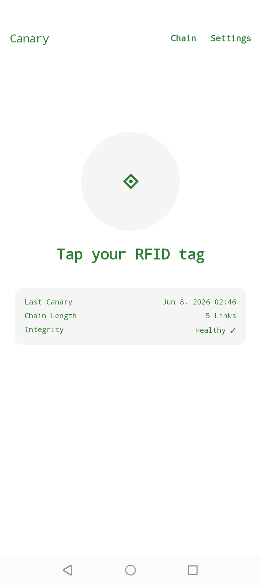
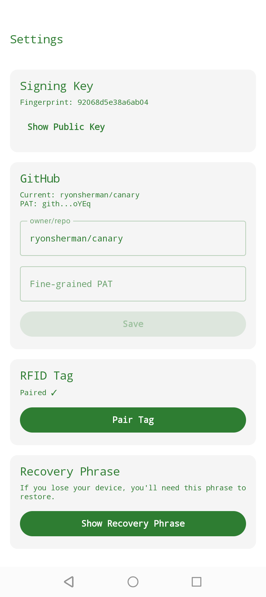

# Canary

A proof-of-life Android app that uses an RFID tag as a physical token.  
Tap daily to prove you're alive — the canary is signed, pushed to GitHub, and anchored to Bitcoin via OpenTimestamps.

 

## How It Works

```
┌──────────────────────┐     NFC tap     ┌─────────────────────┐
│   Phone (Canary      │◄──────────────►│  RFID tag on         │
│   Android App)       │                │  desk / wallet       │
│                      │                └─────────────────────┘
│  1. Read tag secret  │
│  2. Sign canary      │
│  3. Push to GitHub   │
└──────────┬───────────┘
           │ git push canary-YYYY-MM-DDThhmmssZ.txt
           ▼
┌──────────────────────────────┐
│  GitHub Action (on push)      │
│  1. GPG clearsign file        │
│  2. ots stamp (Bitcoin anchor)│
│  3. Create signed git tag     │
│  4. Push .asc + .ots + tag    │
└──────────────────────────────┘
```

Each canary contains the SHA256 hash of the previous day's canary, forming a tamper-evident chain.  
To forge a single entry an attacker needs: the previous day's hash, your GPG key, and a Bitcoin block from before the claimed date.

The public dashboard is at **[ryonsherman.github.io/canary](https://ryonsherman.github.io/canary/)** — shows live status, chain integrity, and recent canaries.

### Verification Layers

| Layer | Mechanism | Prevents |
|---|---|---|
| Hash chain | `sha256(day-N)` in day N+1 | History tampering |
| Ed25519 sig | Phone-side signature | Forgery without the tag |
| GPG sig | Clearsigned `.asc` file | Forgery without GPG key |
| Git tag | `git tag -s` | Force-push / history rewrite |
| OTS | `.ots` file on Bitcoin | Backdating / insertion |

## Requirements

- Android phone with NFC (Android 9+)
- One or more writable NTAG RFID tags (e.g. NTAG213/215/216)
- GitHub account

## Setup

### 1. GitHub

1. Fork or push this repo to your GitHub account
2. Create a **fine-grained PAT** (Settings → Developer settings → Fine-grained tokens) with `contents:write` scope on that repo
3. Add two **repository secrets** for the GPG signing:
   - `GPG_PRIVATE_KEY` — your GPG private key (export: `gpg --export-secret-key --armor <key-id>`)
   - `GPG_PASSPHRASE` — the passphrase for that key
4. Add the GPG public key to your GitHub account (Settings → SSH and GPG keys → New GPG key)

### 2. Build the App

```bash
git clone git@github.com:youruser/canary.git
cd canary
./gradlew assembleDebug
```

Or install directly to a connected phone:

```bash
./gradlew installDebug
```

### 3. First-Run Setup

1. Open the app — you'll see the **Setup** screen
2. Enter your repo as `owner/repo` and your fine-grained PAT
3. Tap **"Pair RFID Tag"** — hold the tag to the back of your phone
4. **WRITE DOWN THE 12-WORD RECOVERY PHRASE** — without it, you cannot recover
5. Save the **QR code** to your gallery — it encodes the repo location for recovery
6. The app pushes your encrypted PAT to `recovery/config.enc` in the repo
7. Tap **"Complete Setup"**

### 4. Daily Use

1. Open the app
2. Tap the phone to the tag
3. The app signs a canary with the hardware-backed Ed25519 key and pushes it to GitHub
4. The GitHub Action GPG-signs it, stamps it with OpenTimestamps, and creates a signed git tag
5. The HomeScreen shows "Alive ✓" briefly, then resets

If you forget, the app sends a nag notification every hour until you tap.

### 5. Recovery

If you lose your phone or tag:

1. Fresh install → **"Scan Recovery QR"** on the welcome screen
2. Scan your saved QR (camera or gallery)
3. Enter your 12-word recovery phrase
4. The app fetches `recovery/config.enc` from your repo, decrypts it, and restores your GitHub PAT
5. Tap a new tag to pair it
6. Complete — fully restored

You can also pair **multiple tags** with the same secret via **Settings → Pair Tag**.  
Use **Settings → Reset → Reset Tags** to generate a new secret (invalidates all current tags).

## Settings

- **Signing Key** — view Ed25519 public key and fingerprint
- **GitHub** — edit owner/repo and PAT (saved securely via EncryptedSharedPreferences)
- **RFID Tag** — pair additional tags with the same secret
- **Recovery Phrase** — view your saved 12-word phrase
- **Reset** — reset tags (new secret) or reset full setup

## Verification

### From the App

The **Chain** screen shows recent canaries and checks hash chain integrity.  
The **Home** screen shows the last canary timestamp (converted to your local timezone) and chain length.

### From a Watcher's Machine

```bash
./verify-chain.sh https://github.com/youruser/canary
```

This clones the repo and checks:
- GPG signature on each canary
- Hash chain continuity
- Signed git tag existence
- OpenTimestamps proof existence

## Architecture

```
app/
├── service/
│   ├── CryptoService.kt       # Ed25519 via Android Keystore
│   ├── NfcService.kt          # Read/write RFID tags
│   ├── GithubService.kt       # Push to GitHub, recovery push/fetch
│   ├── ChainService.kt        # Chain validation
│   ├── OtsService.kt          # OTS proof verification
│   ├── QrService.kt           # BIP39 mnemonic, AES-GCM encrypt/decrypt
│   ├── ReminderReceiver.kt    # Hourly nag BroadcastReceiver
│   └── ReminderScheduler.kt   # AlarmManager scheduling
├── data/
│   ├── PreferencesManager.kt  # EncryptedSharedPreferences
│   └── GithubApi.kt           # OkHttp GitHub API client
├── model/
│   ├── Canary.kt
│   ├── ChainState.kt
│   └── TagState.kt
├── ui/screens/
│   ├── SetupScreen.kt         # 6-step onboarding + tag pairing + recovery phrase + QR
│   ├── HomeScreen.kt          # Daily tap → sign → push → auto-reset
│   ├── ChainScreen.kt         # Chain health timeline
│   ├── RecoveryScreen.kt      # QR scan → phrase → fetch → decrypt → re-pair
│   └── SettingsScreen.kt      # Key info, GitHub edit, tag mgmt, phrase, reset
├── ui/components/
│   └── QrScannerView.kt       # CameraX + ML Kit barcode scanner
├── ui/theme/
│   ├── Theme.kt               # Light/dark system-following theme
│   ├── Color.kt               # App color palette
│   └── Type.kt                # Typography
└── viewmodel/
    ├── HomeViewModel.kt       # Chain state, push guard (Mutex)
    ├── SettingsViewModel.kt
    └── ChainViewModel.kt
```

## Threat Model

| Threat | Mitigation |
|---|---|
| Phone stolen + unlocked | Tag is a separate physical object — need both |
| Tag stolen | Useless without the secret in Android Keystore |
| Both stolen | QR + recovery phrase in safe allows recovery + re-pair |
| PAT leaked | Scoped to `contents:write` on a single repo |
| GPG key compromised (Action) | Revoke and deploy a new one |
| Ed25519 key extracted | Android Keystore TEE/StrongBox hardware backing |
| Forged canary on GitHub | OTS verification fails — Bitcoin block predates claim |
| You die / detained | Chain stops — watchers detect the gap |
| recovery/config.enc on public repo | Encrypted with AES-GCM — 12-word phrase required to decrypt |

## Development

```bash
# Build
JAVA_HOME="/Applications/Android Studio.app/Contents/jbr/Contents/Home" ./gradlew assembleDebug

# Install
adb install -r app/build/outputs/apk/debug/app-debug.apk

# Run tests
adb shell am instrument -w com.canary.test/androidx.test.runner.AndroidJUnitRunner
```

Dependencies managed via Homebrew (see `Brewfile`).

## License

MIT
